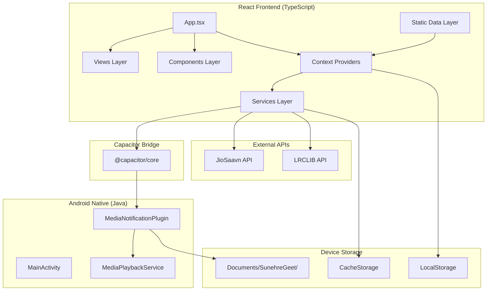
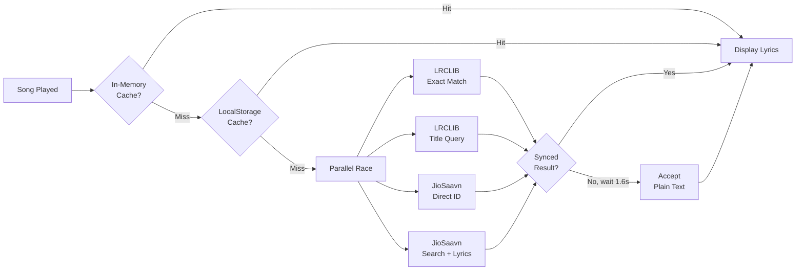
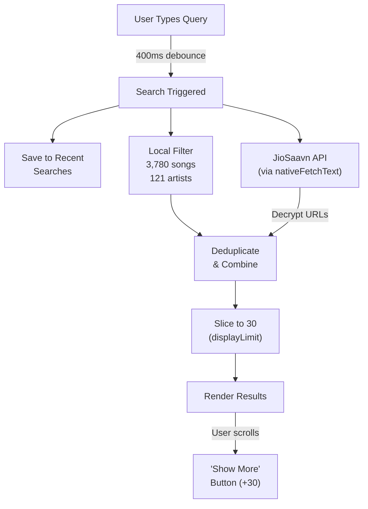

# सुनहरे गीत (Sunehre Geet) — Complete Application Documentation

> **Version**: 33.0 • **Package**: `com.sunehregeet.app` • **Platform**: Android (Capacitor Hybrid)  
> **Last Updated**: August 27, 2026

---

## Table of Contents

1. [Overview](#1-overview)
2. [Tech Stack & Dependencies](#2-tech-stack--dependencies)
3. [Project Structure](#3-project-structure)
4. [Architecture](#4-architecture)
5. [Data Layer](#5-data-layer)
6. [State Management (Context Providers)](#6-state-management-context-providers)
7. [Services Layer](#7-services-layer)
8. [UI Components](#8-ui-components)
9. [Views / Screens](#9-views--screens)
10. [Android Native Layer](#10-android-native-layer)
11. [Lyrics Engine](#11-lyrics-engine)
12. [Search Engine](#12-search-engine)
13. [Audio Playback Engine](#13-audio-playback-engine)
14. [Offline & Download System](#14-offline--download-system)
15. [Cloud Backup & Authentication](#15-cloud-backup--authentication)
16. [Theming & Design System](#16-theming--design-system)
17. [Build & Release Pipeline](#17-build--release-pipeline)
18. [Feature Matrix](#18-feature-matrix)

---

## 1. Overview

**Sunehre Geet** (सुनहरे गीत — "Golden Songs") is a premium Hindi music streaming application dedicated to timeless Bollywood classics and evergreen melodies spanning seven decades (1950s – 2020s). It also includes a curated international artists section.

### Key Highlights
- **3,780+ curated songs** with high-quality 320kbps AAC streaming
- **121 artists** (61 Indian Maestros + 60 International Legends) with HD portraits and rich bios
- **6 Musical Eras** — 50s, 60s, 70s, 80s, 90s, and 2000s
- **Real-time synced karaoke lyrics** with LRC timestamp support and auto-scroll fallback
- **Live online search** — streams any song from JioSaavn's catalog on-demand
- **Offline downloads** — save songs locally for playback without internet
- **Background playback** with Android lock-screen notification controls
- **Google Account cloud backup** — user data survives app reinstalls
- **Sleep timer** — auto-stop playback after a set duration
- **Zero ads, zero subscriptions** — completely free

---

## 2. Tech Stack & Dependencies

### Frontend Framework
| Technology | Version | Purpose |
|:---|:---:|:---|
| **React** | 18.2 | UI component library |
| **TypeScript** | 5.2 | Type-safe JavaScript |
| **Vite** | 5.1 | Build toolchain & dev server |
| **Tailwind CSS** | 3.4 | Utility-first CSS framework |

### Native Bridge
| Technology | Version | Purpose |
|:---|:---:|:---|
| **Capacitor** | 6.0 | Web → Native Android bridge |
| **@capacitor/app** | 6.0 | App lifecycle (back button, exit) |
| **@capacitor/android** | 6.0 | Android platform integration |

### Libraries
| Library | Purpose |
|:---|:---|
| **Lucide React** (0.344) | 1000+ lightweight SVG icon components |
| **CryptoJS** (4.2) | DES decryption for JioSaavn encrypted media URLs |

### Android Native
| Technology | Purpose |
|:---|:---|
| **Java** | Native Android plugin code |
| **AndroidX Media** (1.7.0) | `MediaSessionCompat` for lock-screen controls |
| **Gradle** (8.2.1) | Android build system |
| **Min SDK 22** / **Target SDK 34** | Android 5.1+ through Android 14 |

### Dev Tools
| Tool | Purpose |
|:---|:---|
| **PostCSS + Autoprefixer** | CSS vendor prefixing |
| **@vitejs/plugin-react** | React Fast Refresh in Vite |

---

## 3. Project Structure

```
sunehre-geet-app/
├── index.html                    # Entry HTML with Google Fonts & Sign-In SDK
├── package.json                  # Dependencies & scripts
├── tsconfig.json                 # TypeScript configuration (strict mode)
├── vite.config.ts                # Vite bundler config
├── tailwind.config.js            # Custom retro theme palette
├── postcss.config.js             # PostCSS plugins
├── capacitor.config.json         # Capacitor app config
│
├── public/
│   ├── favicon.png               # App icon
│   ├── logo.png                  # Branding logo
│   └── artists/                  # 121 HD artist portrait JPEGs
│       ├── lata-mangeshkar.jpg
│       ├── kishore-kumar.jpg
│       ├── arijit-singh.jpg
│       └── ... (121 files)
│
├── src/
│   ├── main.tsx                  # React DOM mount point
│   ├── App.tsx                   # Root app with navigation & modal management
│   ├── types.ts                  # TypeScript interfaces (Song, Artist, Decade, Playlist)
│   ├── index.css                 # Global CSS, animations, glassmorphism
│   │
│   ├── data/
│   │   ├── songs.ts              # 3,780+ songs (75,619 lines)
│   │   ├── artists.ts            # 121 artists (2,084 lines)
│   │   └── decades.ts            # 6 musical eras (64 lines)
│   │
│   ├── context/
│   │   ├── AudioContext.tsx       # Global audio engine & playback state
│   │   ├── AuthContext.tsx        # Google auth & cloud sync state
│   │   ├── PlaylistContext.tsx    # Likes, playlists, recents, backup
│   │   └── DownloadContext.tsx    # Offline download manager
│   │
│   ├── services/
│   │   ├── lyricsService.ts      # Multi-source parallel lyrics fetcher
│   │   ├── musicService.ts       # JioSaavn live search & decryption
│   │   ├── cloudSyncService.ts   # Native storage backup/restore
│   │   ├── googleAuthService.ts  # Google session management
│   │   └── offlineService.ts     # CacheStorage offline audio manager
│   │
│   ├── components/
│   │   ├── Header.tsx            # App header with version badge
│   │   ├── Navigation.tsx        # Bottom 5-tab nav bar
│   │   ├── MiniPlayer.tsx        # Floating playback bar
│   │   ├── Player.tsx            # Fullscreen vinyl turntable + lyrics
│   │   ├── SongItem.tsx          # Reusable song row component
│   │   ├── SongList.tsx          # Song list container with equalizer
│   │   ├── ArtistCard.tsx        # Artist avatar card
│   │   ├── SleepTimerModal.tsx   # Sleep timer picker
│   │   ├── CreatePlaylistModal.tsx # Playlist creation/management
│   │   ├── AccountModal.tsx      # Google account & sync modal
│   │   ├── WelcomeLoginModal.tsx # First-launch onboarding
│   │   ├── GoogleSignInButton.tsx # Branded Google sign-in button
│   │   └── ErrorBoundary.tsx     # React error catch & retry
│   │
│   ├── views/
│   │   ├── HomeView.tsx          # Home feed with masterpieces & radio
│   │   ├── ErasView.tsx          # Decades-based exploration
│   │   ├── ArtistsView.tsx       # Artist directory & discography
│   │   ├── SearchView.tsx        # Search with local + online results
│   │   └── LibraryView.tsx       # Liked songs, playlists, downloads
│   │
│   └── utils/
│       └── crypto.ts             # DES decryption for JioSaavn URLs
│
└── android/
    ├── build.gradle              # Root Gradle config
    ├── variables.gradle          # SDK version variables
    └── app/
        ├── build.gradle          # App-level build config (v33)
        └── src/main/
            ├── AndroidManifest.xml  # Permissions & services
            ├── assets/public/       # Bundled web assets + artist images
            └── java/com/sunehregeet/app/
                ├── MainActivity.java            # Activity + WebView config
                ├── MediaNotificationPlugin.java # Custom Capacitor plugin
                └── MediaPlaybackService.java    # Foreground audio service
```

---

## 4. Architecture



### Provider Hierarchy

```
AuthProvider
  └── PlaylistProvider
        └── DownloadProvider
              └── AudioProvider
                    └── MainApp
```

Each provider wraps the next, ensuring proper dependency ordering. `AudioProvider` has access to all outer contexts through hooks.

---

## 5. Data Layer

### 5.1 Songs Database ([songs.ts](file:///C:/Users/ASHIR/.gemini/antigravity/scratch/sunehre-geet-app/src/data/songs.ts))

- **Total**: ~3,780 songs across 75,619 lines of TypeScript
- **Format**: Static JSON array cast to `Song[]`
- **Audio**: Direct 320kbps AAC URLs from Saavn CDN (`aac.saavncdn.com`)
- **Artwork**: 500×500 album art from Saavn CDN (`c.saavncdn.com`)

```typescript
interface Song {
  id: string;           // Unique ID (e.g., "sg-lag-ja-gale")
  artistId?: string;    // Links to Artist.id
  title: string;        // "Lag Ja Gale"
  artist: string;       // "Lata Mangeshkar"
  artists: string[];    // ["Lata Mangeshkar"]
  movie: string;        // "Woh Kaun Thi?"
  year: number;         // 1964
  decade: string;       // "60s"
  duration: number;     // 189 (seconds)
  audioUrl: string;     // Direct stream URL
  coverUrl: string;     // Album art URL
  composer?: string;    // "Madan Mohan"
  lyricist?: string;    // "Raja Mehdi Ali Khan"
  genre?: string;       // "Romantic"
  language?: string;    // "hindi" | "english"
}
```

### 5.2 Artists Database ([artists.ts](file:///C:/Users/ASHIR/.gemini/antigravity/scratch/sunehre-geet-app/src/data/artists.ts))

- **Total**: 121 artists (61 Indian + 60 International)
- Each artist has: name, Hindi name, era range, HD portrait, biography, birth/death years, notable hits, and category

### 5.3 Decades Database ([decades.ts](file:///C:/Users/ASHIR/.gemini/antigravity/scratch/sunehre-geet-app/src/data/decades.ts))

Six eras with Hindi titles, year ranges, descriptions, theme colors, and icon names.

---

## 6. State Management (Context Providers)

### 6.1 AudioContext ([AudioContext.tsx](file:///C:/Users/ASHIR/.gemini/antigravity/scratch/sunehre-geet-app/src/context/AudioContext.tsx)) — 548 lines

The core audio engine managing a singleton `HTMLAudioElement`.

| State | Type | Description |
|:---|:---|:---|
| `currentSong` | `Song \| null` | Currently loaded track |
| `isPlaying` | `boolean` | Playback state |
| `currentTime` | `number` | Current position in seconds |
| `duration` | `number` | Total track length |
| `volume` | `number` | Volume level (0–1) |
| `queue` | `Song[]` | Playback queue |
| `isShuffle` | `boolean` | Shuffle mode |
| `repeatMode` | `'off' \| 'all' \| 'one'` | Repeat behavior |
| `isFullPlayerOpen` | `boolean` | Full-screen player visibility |
| `sleepTimerMinutes` | `number` | Active sleep timer countdown |

**Key behaviors:**
- Persists last-played song and position to `localStorage` on unload
- Restores playback session on app launch
- Syncs track metadata to the browser `MediaSession` API
- Bridges play/pause/next/prev actions to Android native notification plugin
- Dispatches `song-played` custom DOM events for recent history tracking
- Auto-advances to next song in queue on track end

### 6.2 PlaylistContext ([PlaylistContext.tsx](file:///C:/Users/ASHIR/.gemini/antigravity/scratch/sunehre-geet-app/src/context/PlaylistContext.tsx)) — 291 lines

| State | Type | Description |
|:---|:---|:---|
| `likedSongIds` | `string[]` | IDs of liked songs |
| `likedSongsMap` | `Record<string, Song>` | Full Song objects for liked tracks (including online songs) |
| `favorites` | `Song[]` | Derived array of liked Song objects |
| `playlists` | `Playlist[]` | User-created playlists |
| `recentSongIds` | `string[]` | Recently played song IDs (up to 50) |

**Key behaviors:**
- All state persists to `localStorage` and auto-syncs on every change
- On fresh install, auto-restores from device backup file (`Documents/SunehreGeet/`)
- Debounced (600ms) real-time cloud sync on every state change
- `restoreUserData()` merges cloud data into local state

### 6.3 AuthContext ([AuthContext.tsx](file:///C:/Users/ASHIR/.gemini/antigravity/scratch/sunehre-geet-app/src/context/AuthContext.tsx)) — 133 lines

Manages Google authentication via Android's native `AccountManager` (no OAuth client ID required).

### 6.4 DownloadContext ([DownloadContext.tsx](file:///C:/Users/ASHIR/.gemini/antigravity/scratch/sunehre-geet-app/src/context/DownloadContext.tsx)) — 82 lines

Manages offline song downloads using the browser `CacheStorage` API with cache name `sunehre-geet-offline-v1`.

---

## 7. Services Layer

### 7.1 Lyrics Service ([lyricsService.ts](file:///C:/Users/ASHIR/.gemini/antigravity/scratch/sunehre-geet-app/src/services/lyricsService.ts)) — 314 lines

See [Section 11: Lyrics Engine](#11-lyrics-engine) for full details.

### 7.2 Music Service ([musicService.ts](file:///C:/Users/ASHIR/.gemini/antigravity/scratch/sunehre-geet-app/src/services/musicService.ts)) — 109 lines

- `searchSongs(query)` — Searches JioSaavn's API and decrypts encrypted media URLs
- `fetchTop100ForArtist(artistName)` — Fetches an artist's top tracks
- Uses `decryptMediaUrl()` (DES-ECB with key `38346591`) to convert encrypted URLs to direct stream links

### 7.3 Cloud Sync Service ([cloudSyncService.ts](file:///C:/Users/ASHIR/.gemini/antigravity/scratch/sunehre-geet-app/src/services/cloudSyncService.ts)) — 93 lines

- `syncToGoogleCloud(user, data)` — Saves backup JSON to device persistent storage
- `fetchCloudBackup(key)` — Reads backup from device storage
- Backup payload: `{ version, user, likedSongIds, likedSongs, playlists, recentSongIds }`
- Storage path: `/storage/emulated/0/Documents/SunehreGeet/backup_<hash>.json`

### 7.4 Google Auth Service ([googleAuthService.ts](file:///C:/Users/ASHIR/.gemini/antigravity/scratch/sunehre-geet-app/src/services/googleAuthService.ts)) — 77 lines

- `getStoredSession()` / `storeSession()` — LocalStorage session persistence
- `isFirstTimeLaunch()` / `markWelcomeSeen()` — First-launch flag tracking
- `createProfile(email)` — Generates display name from email address

### 7.5 Offline Service ([offlineService.ts](file:///C:/Users/ASHIR/.gemini/antigravity/scratch/sunehre-geet-app/src/services/offlineService.ts)) — 97 lines

- `saveSongOffline(song)` — Fetches audio stream and stores in CacheStorage
- `getOfflineAudioUrl(songId)` — Retrieves cached audio blob URL
- `isSongDownloaded(songId)` — Checks download status
- `removeOfflineSong(songId)` — Deletes cached audio
- `getDownloadedSongs()` — Returns all downloaded song metadata

---

## 8. UI Components

### Core Playback Components

| Component | Lines | Description |
|:---|:---:|:---|
| [Player.tsx](file:///C:/Users/ASHIR/.gemini/antigravity/scratch/sunehre-geet-app/src/components/Player.tsx) | 479 | Full-screen player with rotating vinyl CD animation, dual-view (turntable / lyrics), seek bar, shuffle/repeat toggles, download button, and favorites |
| [MiniPlayer.tsx](file:///C:/Users/ASHIR/.gemini/antigravity/scratch/sunehre-geet-app/src/components/MiniPlayer.tsx) | 101 | Floating bottom bar with progress indicator, track info, play/pause, like, and skip controls |
| [SongItem.tsx](file:///C:/Users/ASHIR/.gemini/antigravity/scratch/sunehre-geet-app/src/components/SongItem.tsx) | 225 | Reusable song row with album art, duration, animated equalizer for active track, context menu (download, add to playlist, remove) |
| [SongList.tsx](file:///C:/Users/ASHIR/.gemini/antigravity/scratch/sunehre-geet-app/src/components/SongList.tsx) | 167 | List container that wraps SongItems with section headers |

### Navigation & Layout

| Component | Lines | Description |
|:---|:---:|:---|
| [Header.tsx](file:///C:/Users/ASHIR/.gemini/antigravity/scratch/sunehre-geet-app/src/components/Header.tsx) | 92 | Sticky header with app name (सुनहरे गीत), version badge, sleep timer indicator, and user avatar/login button |
| [Navigation.tsx](file:///C:/Users/ASHIR/.gemini/antigravity/scratch/sunehre-geet-app/src/components/Navigation.tsx) | 48 | Bottom tab bar: Home, Decades, Singers, Search, Library |
| [ErrorBoundary.tsx](file:///C:/Users/ASHIR/.gemini/antigravity/scratch/sunehre-geet-app/src/components/ErrorBoundary.tsx) | 54 | Catches React rendering errors and shows retry UI instead of blank screen |

### Modals

| Component | Lines | Description |
|:---|:---:|:---|
| [SleepTimerModal.tsx](file:///C:/Users/ASHIR/.gemini/antigravity/scratch/sunehre-geet-app/src/components/SleepTimerModal.tsx) | 72 | Preset timer picker (15m, 30m, 45m, 60m, 90m, Off) |
| [CreatePlaylistModal.tsx](file:///C:/Users/ASHIR/.gemini/antigravity/scratch/sunehre-geet-app/src/components/CreatePlaylistModal.tsx) | 199 | Create new playlist or add/remove songs from existing playlists |
| [AccountModal.tsx](file:///C:/Users/ASHIR/.gemini/antigravity/scratch/sunehre-geet-app/src/components/AccountModal.tsx) | 213 | Google profile display, sync counters, manual backup trigger, sign out |
| [WelcomeLoginModal.tsx](file:///C:/Users/ASHIR/.gemini/antigravity/scratch/sunehre-geet-app/src/components/WelcomeLoginModal.tsx) | 92 | First-launch onboarding with Google Sign-In or guest skip |

### Other

| Component | Lines | Description |
|:---|:---:|:---|
| [ArtistCard.tsx](file:///C:/Users/ASHIR/.gemini/antigravity/scratch/sunehre-geet-app/src/components/ArtistCard.tsx) | 55 | Circular avatar card with artist name, era badge, and quick-play |
| [GoogleSignInButton.tsx](file:///C:/Users/ASHIR/.gemini/antigravity/scratch/sunehre-geet-app/src/components/GoogleSignInButton.tsx) | 45 | Branded Google authentication button with official logo |

---

## 9. Views / Screens

### 9.1 Home ([HomeView.tsx](file:///C:/Users/ASHIR/.gemini/antigravity/scratch/sunehre-geet-app/src/views/HomeView.tsx)) — 288 lines

- **Non-Stop Golden Radio** banner with single-tap to shuffle play all Indian songs
- **Random Masterpieces** horizontal carousel — curated algorithm prioritizing golden legends (Kishore, Lata, Rafi, Mukesh, Asha, Jagjit, Sonu, KK, Kumar Sanu, Udit Narayan) with shuffle regeneration
- **Golden Decades** grid — quick navigation to era-based exploration
- **Top Maestros** circular avatar row — quick artist discography access

### 9.2 Decades / Eras ([ErasView.tsx](file:///C:/Users/ASHIR/.gemini/antigravity/scratch/sunehre-geet-app/src/views/ErasView.tsx)) — 114 lines

- Horizontal decade tab switcher (50s through 2000s)
- Hero banner with era title, Hindi subtitle, year range, and description
- "Play All" button to radio-shuffle the entire era
- Full song listing filtered by selected decade

### 9.3 Artists / Singers ([ArtistsView.tsx](file:///C:/Users/ASHIR/.gemini/antigravity/scratch/sunehre-geet-app/src/views/ArtistsView.tsx)) — 301 lines

- Category toggle: **Bollywood** (61 artists) vs **International** (60 artists)
- Search bar to filter artists by name or Hindi name
- Artist grid with HD portraits
- **Discography view** — tapping an artist shows their complete song catalog with strict name matching (handles edge cases like "KK" not matching "Kavita Krishnamurthy")

### 9.4 Search ([SearchView.tsx](file:///C:/Users/ASHIR/.gemini/antigravity/scratch/sunehre-geet-app/src/views/SearchView.tsx)) — 395 lines

See [Section 12: Search Engine](#12-search-engine) for full details.

### 9.5 Library ([LibraryView.tsx](file:///C:/Users/ASHIR/.gemini/antigravity/scratch/sunehre-geet-app/src/views/LibraryView.tsx)) — 401 lines

Four tabs:
1. **Favorites (❤️)** — Liked songs with one-tap "Restore 76 Evergreen Classics" button
2. **Playlists (📋)** — User-created playlists with create/delete/view
3. **Recent (🕐)** — Last 50 played songs
4. **Downloads (📥)** — Offline-saved songs with storage usage indicator

---

## 10. Android Native Layer

### 10.1 MainActivity ([MainActivity.java](file:///C:/Users/ASHIR/.gemini/antigravity/scratch/sunehre-geet-app/android/app/src/main/java/com/sunehregeet/app/MainActivity.java)) — 79 lines

- Extends Capacitor's `BridgeActivity`
- Registers `MediaNotificationPlugin` as a custom Capacitor plugin
- Sets `FLAG_KEEP_SCREEN_ON` to prevent display sleep during playback
- Requests `POST_NOTIFICATIONS` permission on Android 13+ (API 33)
- Configures WebView: disables cache, enables media autoplay without user gesture, enables DOM/Database storage
- Clears notifications on activity destroy

### 10.2 MediaNotificationPlugin ([MediaNotificationPlugin.java](file:///C:/Users/ASHIR/.gemini/antigravity/scratch/sunehre-geet-app/android/app/src/main/java/com/sunehregeet/app/MediaNotificationPlugin.java)) — 495 lines

Custom Capacitor plugin exposing 7 methods to the JavaScript layer:

| Plugin Method | Purpose |
|:---|:---|
| `updateNotification(call)` | Creates/updates the lock-screen media notification with track title, artist, album art bitmap, and play/pause state. Starts `MediaPlaybackService` as foreground. |
| `hideNotification(call)` | Cancels the notification, stops foreground service, releases wake/wifi locks. |
| `startOfficialGoogleSignIn(call)` | Launches Android's native `AccountManager.newChooseAccountIntent()` for Google account selection — no OAuth credentials needed. |
| `getDeviceGoogleAccounts(call)` | Reads Google accounts registered on the device. |
| `saveLocalCloudBackup(call)` | Writes JSON string to `/Documents/SunehreGeet/backup_<hash>.json` — persists across app uninstalls. |
| `loadLocalCloudBackup(call)` | Reads JSON backup from device external storage. |
| `fetchHttpUrl(call)` | Performs native HTTP GET requests with custom User-Agent, bypassing WebView CORS restrictions. Used by lyrics and search services. |

### 10.3 MediaPlaybackService ([MediaPlaybackService.java](file:///C:/Users/ASHIR/.gemini/antigravity/scratch/sunehre-geet-app/android/app/src/main/java/com/sunehregeet/app/MediaPlaybackService.java)) — 273 lines

Android foreground service ensuring uninterrupted background audio:

- **`FOREGROUND_SERVICE_TYPE_MEDIA_PLAYBACK`** — declares media playback intent
- **`PARTIAL_WAKE_LOCK`** (24-hour) — prevents CPU sleep during streaming
- **`WIFI_MODE_FULL_HIGH_PERF`** — prevents Wi-Fi radio from sleeping
- **`MediaSessionCompat`** — exposes play, pause, skip-next, skip-prev callbacks to the system
- Builds a persistent notification with three media action buttons (Previous, Play/Pause, Next)
- Dispatches actions back to the WebView via `MediaNotificationPlugin.dispatchActionStatic()`

### 10.4 Permissions

**Declared:**
- `INTERNET` — Network access for streaming
- `ACCESS_NETWORK_STATE` — Connectivity detection
- `WAKE_LOCK` — Background CPU wakefulness
- `POST_NOTIFICATIONS` — Android 13+ notification permission
- `FOREGROUND_SERVICE` + `FOREGROUND_SERVICE_MEDIA_PLAYBACK` — Background audio service
- `REQUEST_IGNORE_BATTERY_OPTIMIZATIONS` — Prevent Doze from killing playback

**Explicitly removed** (from Capacitor defaults):
- SMS, Call Log, Phone State, Audio Recording, Contacts, Location, Camera

---

## 11. Lyrics Engine

### Architecture



### Source Priority
1. **LRCLIB Exact Match** — `track_name + artist_name` search, strongly prefers `syncedLyrics` over `plainLyrics`
2. **LRCLIB Title Query** — Broader `q=` search, prefers entries with `syncedLyrics`
3. **JioSaavn Direct** — `lyrics.getLyrics` API using the song's JioSaavn ID
4. **JioSaavn Search** — Searches JioSaavn for the song by title+artist, then fetches lyrics for the best match

### Race Strategy (`raceForFirstValid`)
- All 4 sources are queried **simultaneously** in parallel
- **Synced lyrics** (with `[mm:ss.xx]` timestamps) resolve **immediately** — best possible outcome
- **Plain text lyrics** (no timestamps) are held for up to **1.6 seconds** to give synced sources time to arrive
- **Hard timeout**: 2.5 seconds maximum — after which whatever is available (or null) is returned
- Results are cached in **memory** (Map) and **localStorage** for instant future access

### Display Modes
| Mode | Badge | Behavior |
|:---|:---:|:---|
| **Synced Karaoke** | 🟡 `Karaoke` | Real-time line highlighting with 350ms anticipation offset. Tap any line to seek. Auto-scroll to active line. |
| **Auto-Scroll** | 🔵 `Auto-Scroll` | Estimated line position based on `(currentTime / duration) × totalLines`. Highlights and auto-scrolls the estimated current line. |
| **No Lyrics** | — | Nostalgic card: *"यह एक दुर्लभ और अनमोल गीत है"* / *"This is a Rare Vintage Masterpiece"* |

---

## 12. Search Engine

### Architecture



### Features
- **400ms debounced input** — prevents excessive API calls while typing
- **Local matching** — filters `SONGS` by title, artist, or movie name; filters `ARTISTS` by name or Hindi name
- **Online streaming** — queries JioSaavn API, decrypts encrypted media URLs with DES, and presents as playable results
- **30-song pagination** — renders results in chunks of 30 to prevent WebView DOM overload
- **Recent searches** — saved on every debounced query and displayed as quick-tap pills
- **Trending searches** — 16 preset classic song suggestions
- **Artist cards** — matching artists shown as horizontal scrollable avatar cards

### URL Decryption
JioSaavn returns encrypted media URLs. The app decrypts them using:
```
Algorithm: DES-ECB
Key: "38346591" (UTF-8)
Input: Base64-encoded ciphertext from API
Output: Direct AAC stream URL (upgraded to 320kbps)
```

---

## 13. Audio Playback Engine

### Singleton Audio Element
A single `HTMLAudioElement` is created once and reused for all playback. This prevents resource leaks and ensures consistent behavior.

### Playback Flow
```
User taps song → playSong(song, queue)
  → Set currentSong state
  → Set audio.src = song.audioUrl (or offline URL if downloaded)
  → audio.play()
  → Update native notification (title, artist, artwork)
  → Dispatch 'song-played' event (for recent history)
  → On track end:
      → If repeat=one: replay same song
      → If repeat=all: next in queue (wraps around)
      → If repeat=off: next in queue (stops at end)
      → If shuffle: random track from queue
```

### Session Persistence
On every `beforeunload` and periodically, the engine saves to `localStorage`:
- Current song ID
- Current playback position
- Queue contents
- Shuffle/repeat state

On app launch, if saved state exists, the last song is restored (paused at saved position).

### Sleep Timer
- User selects duration (15/30/45/60/90 minutes)
- Countdown runs via `setInterval`
- When timer hits zero: pause audio, clear notification, reset timer
- Timer badge visible in the Header component

---

## 14. Offline & Download System

### Storage
- **Audio streams**: Stored in `CacheStorage` API (cache name: `sunehre-geet-offline-v1`)
- **Metadata**: Stored in `localStorage` as JSON array of Song objects

### Download Flow
```
User taps download icon on SongItem
  → DownloadContext.downloadSong(song)
    → fetch(song.audioUrl) as blob
    → Store response in CacheStorage with key = audioUrl
    → Save song metadata to localStorage
    → Update downloadedSongs state
```

### Offline Playback
When `AudioContext.playSong()` is called:
1. Check if song is in offline cache via `isSongDownloaded()`
2. If yes: retrieve cached audio blob URL via `getOfflineAudioUrl()`
3. If no: use the remote `audioUrl`

### Storage Display
The Library's Downloads tab shows approximate storage usage calculated from the number of downloaded songs.

---

## 15. Cloud Backup & Authentication

### Google Sign-In Flow
```
User taps "Sign in with Google"
  → AuthContext.loginWithGoogle()
    → Native: AccountManager.newChooseAccountIntent()
    → User picks Google account
    → Returns { email, name }
    → Create GoogleUserProfile
    → Store in localStorage
    → Try to fetch existing cloud backup
    → If backup exists: restore data to PlaylistContext
    → If no backup: sync current data to cloud
```

> [!NOTE]
> The app uses Android's native `AccountManager` rather than OAuth. This means no Google Cloud Console client ID is required — it simply reads the device's registered Google accounts.

### Auto-Backup
`PlaylistContext` watches all state changes with a 600ms debounce. On every change:
1. Constructs backup payload: `{ likedSongIds, likedSongs, playlists, recentSongIds }`
2. Calls `CloudSyncService.syncToGoogleCloud()` 
3. Which calls the native plugin `saveLocalCloudBackup()`
4. Which writes JSON to `/storage/emulated/0/Documents/SunehreGeet/backup_<hash>.json`

> [!IMPORTANT]
> This backup location is in the device's shared `Documents` directory, which **survives app uninstalls**. On a fresh install, `PlaylistContext` automatically detects and restores this backup.

---

## 16. Theming & Design System

### Color Palette (Retro Gold Theme)

| Token | Hex | Usage |
|:---|:---:|:---|
| `retro-dark` | `#0e0b16` | App background |
| `retro-surface` | `#18122B` | Card backgrounds |
| `retro-card` | `#22194D` | Elevated surfaces |
| `retro-gold` | `#E5A93C` | Primary accent (buttons, highlights, active states) |
| `retro-amber` | `#F39C12` | Secondary accent |
| `retro-cream` | `#FFF4E0` | Primary text |
| `retro-muted` | `#9B90B2` | Secondary/inactive text |
| `retro-accent` | `#D97706` | Tertiary accent |

### Typography
- **Serif**: `Cinzel`, `Playfair Display` — used for titles, song names, branding
- **Sans**: `Plus Jakarta Sans` — used for body text, labels, metadata

### Custom Animations
- `spin-slow`: 18-second continuous rotation for the vinyl record
- `fade-in`: Opacity transition for view changes
- `slide-up`: Bottom sheet modal entrance
- Equalizer bars: CSS keyframe animation for active song indicators

### Glassmorphism
Navigation bar, mini player, and modals use `backdrop-blur-md` with semi-transparent backgrounds (`bg-black/85`, `glass-panel` class) for depth.

---

## 17. Build & Release Pipeline

### Commands

```powershell
# 1. Clean previous build
Remove-Item -Recurse -Force "dist" -ErrorAction SilentlyContinue

# 2. TypeScript compile + Vite bundle
npm run build
# Runs: tsc && vite build
# Output: dist/ directory (~2.4 MB JS + 38 KB CSS)

# 3. Copy web bundle to Android assets
npx cap copy android

# 4. Copy artist images to Android assets
Copy-Item -Recurse -Force "public\artists\*" "android\app\src\main\assets\public\artists\"

# 5. Clean and build Android APK
cd android
.\gradlew clean
.\gradlew assembleDebug

# 6. Copy final APK
Copy-Item "android\app\build\outputs\apk\debug\app-debug.apk" "..\sunehre-geet.apk" -Force
```

### Output
- **APK size**: ~33.3 MB
- **APK location**: `sunehre-geet-app/sunehre-geet.apk`
- **Bundle**: Single-chunk JS (~2.4 MB, 481 KB gzipped)

### Version Bumping
Three files must be updated for each release:
1. `src/components/Header.tsx` — Version badge display (`v33.0`)
2. `android/app/build.gradle` — `versionCode` and `versionName`
3. (Optional) `package.json` — npm version field

---

## 18. Feature Matrix

| Feature | Status | Implementation |
|:---|:---:|:---|
| Stream 3,780+ songs | ✅ | Static catalog with direct CDN URLs |
| Browse 121 artists | ✅ | HD portraits, bios, discographies |
| Browse 6 decades | ✅ | Era-specific filtering and radio play |
| Live online search | ✅ | JioSaavn API + DES URL decryption |
| Real-time karaoke lyrics | ✅ | LRCLIB synced LRC + 350ms anticipation |
| Auto-scroll plain lyrics | ✅ | Progress-based line estimation |
| Background playback | ✅ | Foreground service + WakeLock + WifiLock |
| Lock-screen controls | ✅ | MediaSession + notification actions |
| Offline downloads | ✅ | CacheStorage API |
| Sleep timer | ✅ | 15/30/45/60/90 minute presets |
| Like / favorite songs | ✅ | LocalStorage + cloud backup |
| Custom playlists | ✅ | Create, edit, delete, add/remove songs |
| Recent play history | ✅ | Last 50 songs tracked |
| Google account backup | ✅ | Native AccountManager + device storage |
| Survive app reinstall | ✅ | Documents/SunehreGeet/ persistent backup |
| Double-back-to-exit | ✅ | 4-second window with Hindi toast |
| Error boundary | ✅ | React error catch with retry UI |
| Responsive design | ✅ | Mobile-first, max-width container |

---

> *Built with ❤️ for lovers of timeless Hindi music*
